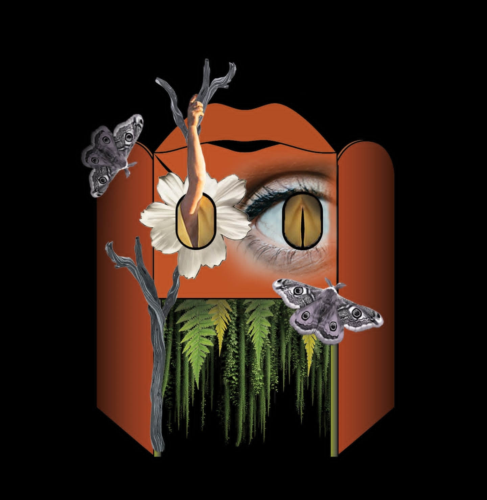
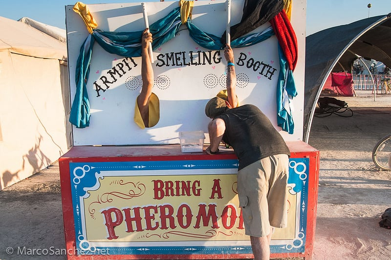
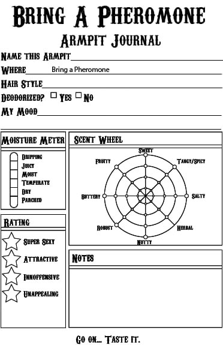

# Room Service 2025 - Bring a Pheromone Proposals

Welcome! Multiple variations on the **Bring a Pheromone** installation for Room Service 2025, organized by creative development rounds.

### Final Version - Microbiome Focus ⭐

Emphasizes microbiome/flora intelligence beating The Mind at matchmaking, with emotional freedom through journaling and paying attention to bodily signals.

- [View Full Proposal](Version_FINAL_Microbiome_Focus.html)

---

## 💪 Companion Projects

## The Bound Banquet (Elbow Appreciation)

We celebrate connection by giving up control. Arms splinted with branches, guests become plant-person hybrids who can't feed themselves. Everything becomes a team effort—an experiment in cooperation, care, and collective awkwardness. Together, we learn that being bound can be surprisingly freeing.

- [View Full Project Details](Bound_Banquet.html)
  
---

### Signal Station Version

Bodies communicating around The Mind's attempts at control—a signal station metaphor for pheromone broadcasting.

- [View Full Proposal](Version_A_Signal_Station.html)

### Algorithm Malfunction Version

A matchmaking system designed to commodify attraction gets hacked by the microbiome—capitalism satirized through technology failure.

- [View Full Proposal](Version_B_Algorithm_Malfunction.html)

### Not For Sale Version

Bodies refusing commodification, celebrating the unmarketable authenticity of pheromones that won't perform as products.

- [View Full Proposal](Version_C_Not_For_Sale.html)

### Synthesis Version

Combines algorithm malfunction, signal station, and anti-capitalism themes into a unified narrative.

- [View Full Proposal](Version_FINAL_Synthesis.html)

## Event Theme

**"The Body vs. The Mind: An Impossible Categorization"**

## The Core Concept

Three carnival-style glory holes. One portable booth. An army of trained Scent Sommeliers. Your armpit has stories to tell, and we're here to help people listen.

*The current portable booth structure*

---

## 📋 Initial Options (Where It All Started)

The first three approaches, ranging from traditional RAT format to absurdist research study.

### Option 1: Bring a Pheromone (Traditional RAT)

Comprehensive traditional format covering all bases: training, matchmaking, certification, community building.

- [View Full Proposal](Bring_a_Pheromone_RAT_2025.html)

### Option 2: Pheromone Decategorization Lab

Theme-focused exploration of how pheromones resist categorization, with emphasis on bodily autonomy.

- [View Full Proposal](Pheromone_Decategorization_RAT_Option2.html)

### Option 3: The Armpit Glory Hole Research Study

Absurdist "research study" framing with IRB-style documentation and carnival booth methodology.

- [View Full Proposal](Armpit_Glory_Hole_RAT_Option3.html)

---

## ⭐ Metatheme but Silly Options (Metatheme + Aesthetic Integration)

These options deeply engage with the North Star question, Sonya Renee Taylor, Descartes critique, and body commodification while staying playful and incorporating specific Style Guide aesthetics.

### Option 1: The Body Refuses (An Armpit Manifesto)

Descartes said your body is a machine. Capitalism turned it into a product. Your armpit disagrees. **Silly-serious exploration of bodily autonomy through Scent Sommelier training, pheromone matchmaking, and Victorian specimen cabinet aesthetics being invaded by botanical chaos.**

- [View Full Proposal](Final_Option_1_Liberation_Project.html)

### Option 2: Bodies Are Impossible to Categorize (We Have Receipts)

Society spent centuries sorting bodies into categories. Then someone invented armpit-sniffing as research methodology and the whole system collapsed. **We're collecting evidence of that collapse with carnival booth glory holes, certification, and a growing archive of categorical failure.**

- [View Full Proposal](Final_Option_2_Impossible_to_Categorize.html)

### Option 3: Your Body Is Not For Sale (But Your Armpit Might Have Opinions)

Late-stage capitalism wants to turn your body into a commodity. Your sweat glands didn't get the memo. **Pop-up research station documenting what happens when bodies communicate in languages that can't be standardized, productized, or reduced to algorithms. The Commodity Exchange Floor where products go to die and bodies get to be free.**

- [View Full Proposal](Final_Option_3_Body_Commodity_Exchange.html)

---

## 📖 Narrative Options (Bold Thematic Reframings)

Creative approaches that reimagine the concept through strong narrative frames that integrate deeply with RS25's themes.

### Option 1: The Pheromone Underground

Your armpits are sending secret messages the Mind can't intercept. We're a clandestine station training Scent Sommeliers to read the chemical rebellion. **Pheromones as encrypted resistance communication.**

- [View Full Proposal](Option_1_Pheromone_Underground.html)

### Option 2: The Armpit Index - A Comprehensive Failure of Taxonomy

The Mind tried to categorize every smell in The Body. It failed spectacularly. We're documenting that failure through Victorian naturalist aesthetics and gorgeously useless classification systems. **Every armpit is proof that some things refuse to be filed away.**

- [View Full Proposal](Option_2_The_Armpit_Index.html)

### Option 3: The Gut Whispers - Messages from Exile

The Gut has been in exile, but it's broadcasting through your armpits. We're a listening station decoding chemical signals the Mind can't intercept. **Direct integration with Friday's narrative about finding the exiled Gut.**

- [View Full Proposal](Option_3_The_Gut_Whispers.html)

### Option 4: Body Knows Best - The Anti-Dating App

The Mind wants to swipe through profiles and make rational choices. Your body just wants to smell someone's pits. We're the anti-algorithm where your nose opts out of what your brain thinks it wants. **Zero questionnaires. Just pheromones and bodily autonomy.**

- [View Full Proposal](Option_4_Body_Knows_Best.html)

---

## 🌉 BRIDGE Options (Medium Creative Integration)

Medium creative approaches that bridge traditional RAT structure with stronger thematic integration—accessible hooks with meaningful depth.

### Option A: The Body's Filing Cabinet

The Mind tried to organize every body signal into neat categories. We're the overworked archivists documenting the glorious failure of bureaucratic body control. **Mid-century office aesthetics being invaded by botanical chaos.**

- [View Full Proposal](Round2_Option_A_Bodys_Filing_Cabinet.html)

### Option B: Scent Signal Station

Your body parts want to talk to each other, but the Mind keeps blocking the signals. We're amplifying the conversations your body is already having on frequencies the Mind can't monitor. **Body-to-body communication made visible.**

- [View Full Proposal](Round2_Option_B_Scent_Signal_Station.html)

### Option C: The Compatibility Algorithm (System Malfunction)

Our matchmaking algorithm was supposed to use rational criteria. It malfunctioned. Now it only works with armpits. The Mind is furious. The Body is thriving. **Tech startup aesthetic being destroyed by botanical rebellion.**

- [View Full Proposal](Round2_Option_C_Algorithm_Malfunction.html)

---

## Key Features (All Options)

- 🎪 Portable 50"×24"
- 👃 Scent Sommelier training program
- 🌹 Pheromone-based interaction and optional matchmaking
- 🎭 Interactive, consent-based, body-positive experience
- ⏰ Operating hours: Primarily Saturday 2pm-1am, plus Friday/Sunday sessions
- *These 13 proposals represent different levels of thematic integration with the same core interactive experience. Choose based on your preferred balance of accessibility vs. creative boldness vs. metatheme engagement.*

---

## 📜 Historical Context: Bring a Pheromone at Burning Man

This isn't our first rodeo! Bring a Pheromone has been delighting participants since 2013.

### The Original Booth

*The iconic red, white, and blue armpit glory-hole booth at Burning Man 2015-2018*

### Scent Sommelier Certification

*Official certification card given to participants after completing Sommelier training*

### Burning Man 2018 Placement Questionnaire

Want to see how we've described this project before? Check out our [2018 Burning Man Placement Questionnaire](historical/Bring_a_Pheromone_2018_Placement_Questionnaire.html) to see the evolution of Bring a Pheromone through the years.

**Previous Burning Man Years:** 2013, 2015, 2016, 2017, 2018

**Notable Press Coverage:**

- Featured in Burning Man's Jack Rabbit Speaks
- Buzzfeed's "53 Things I Learned at Burning Man"
- Burning Man Hate Week (yes, really!)
- Multiple blogs and playa guides

**Signature Events from Previous Years:**

- Pheromone Happy Hour (Scent Sommelier training sessions)
- Pheromone Tinder (matchmaking via armpit attraction)
- Pits or Balls (can you tell the difference?)
- Sniff Out Yer Mate (find your partner by smell alone)
- 24/7 self-serve armpit glory-hole booth

**The Legacy:** Thousands of armpits sniffed, hundreds of Scent Sommeliers certified, countless "Oh my god, is that an armpit-smelling booth??" reactions, and at least a few lasting connections made through the power of pheromones.

**Now we're bringing it to Room Service 2025** with fresh thematic integration, Victorian botanical aesthetics, and a whole new layer of philosophical armpit appreciation!

---

*"Your nose knows." - Bring a Pheromone motto since 2013*
